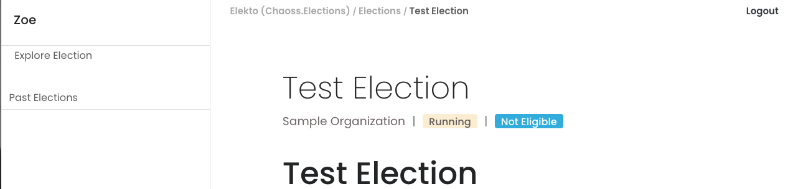
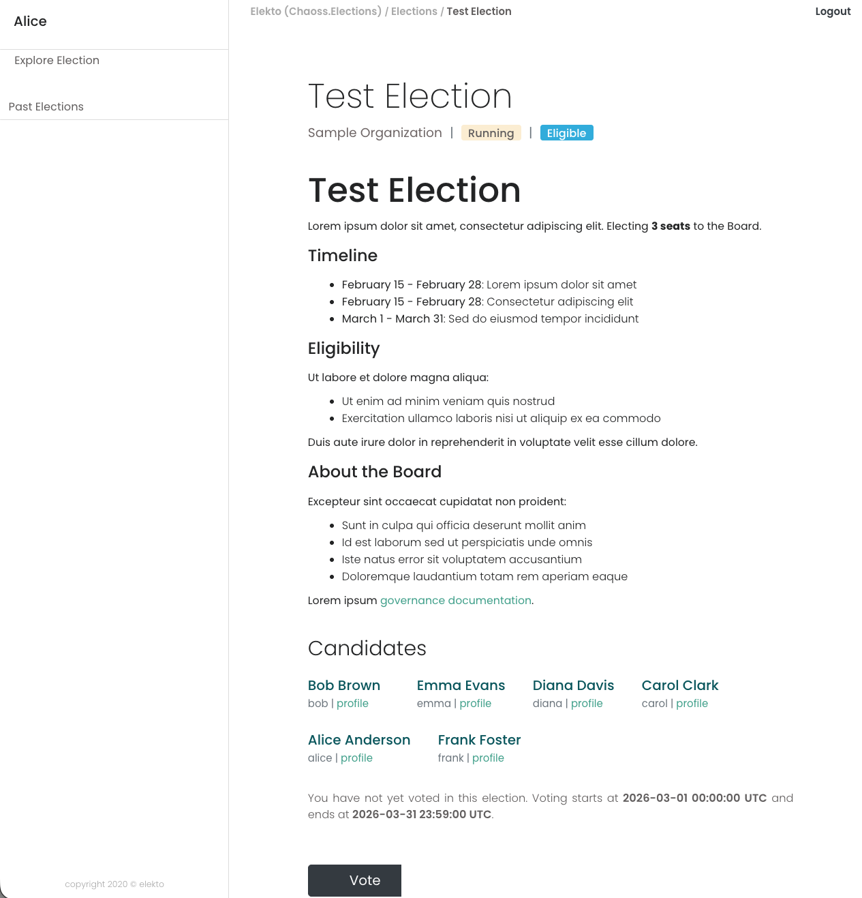
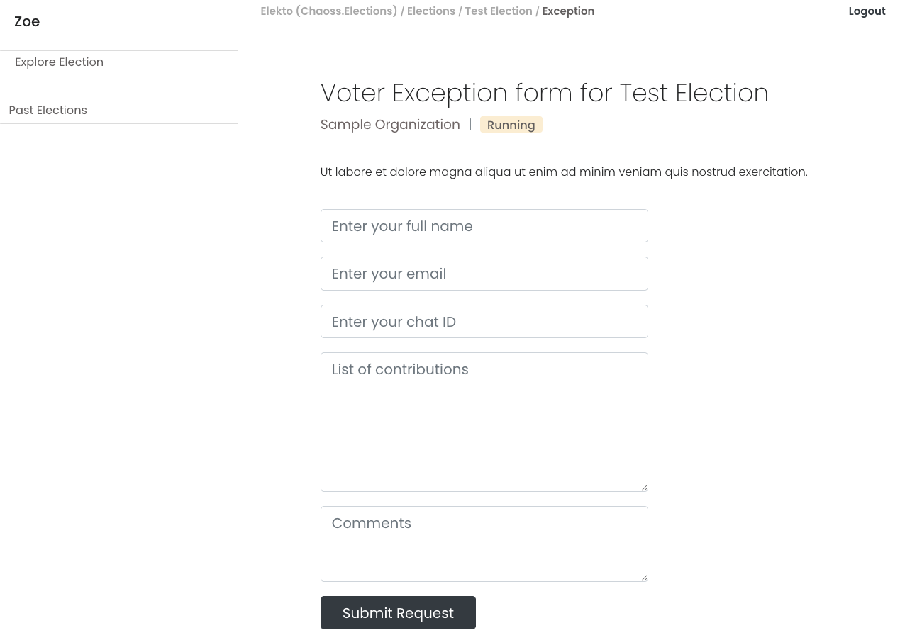
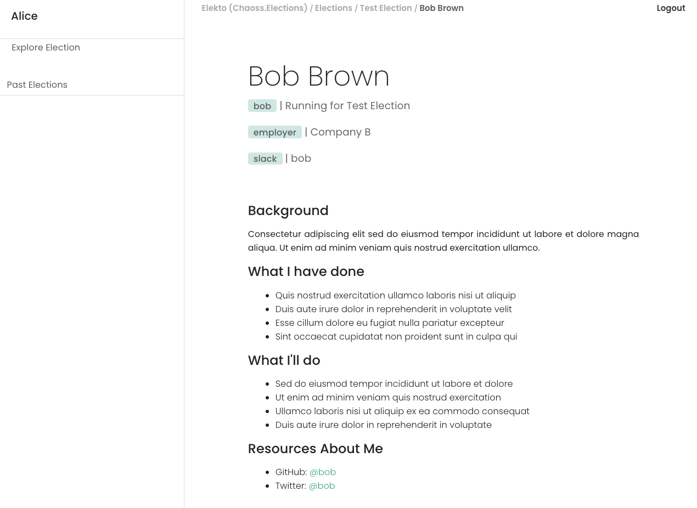
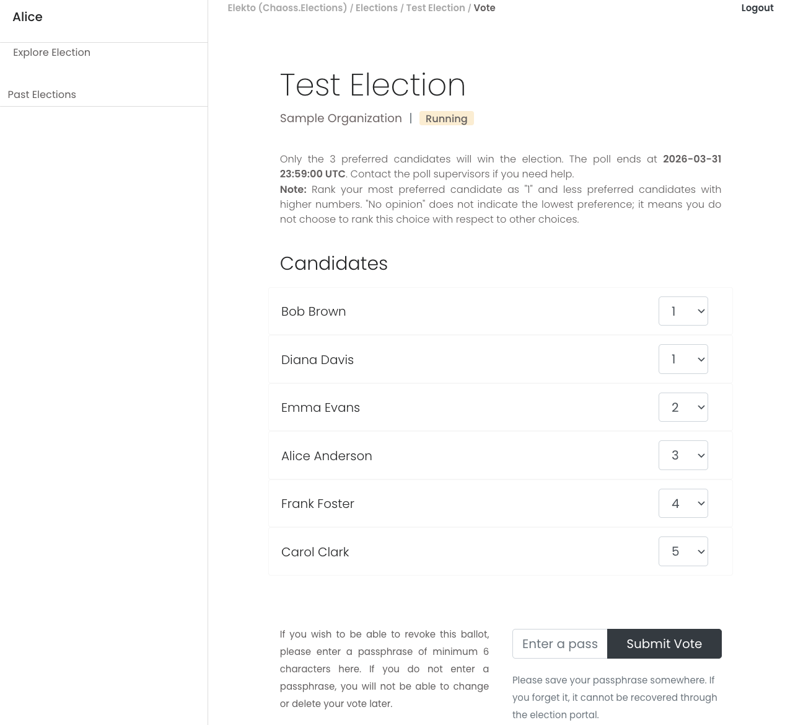
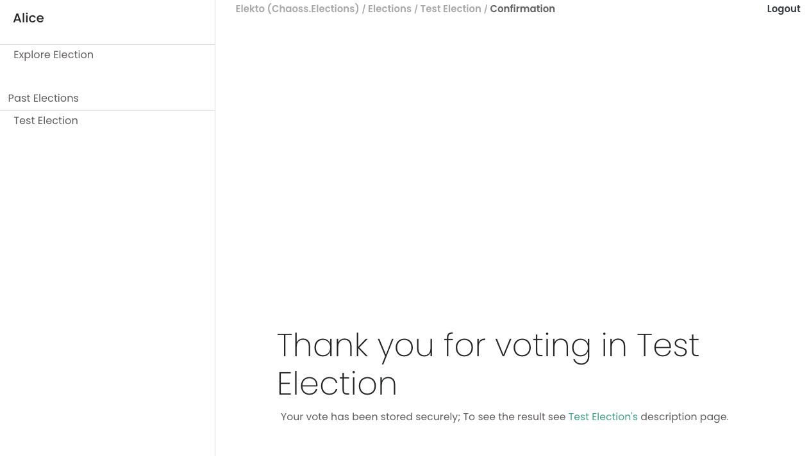
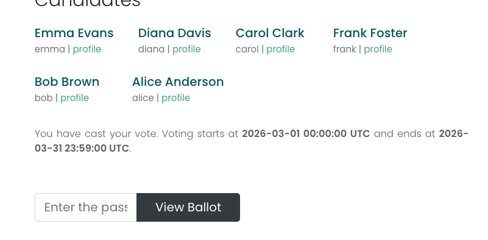
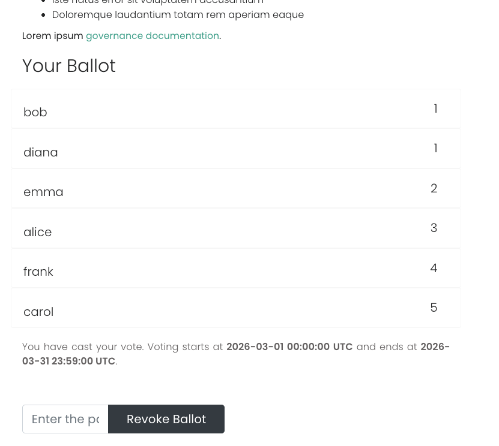

# CHAOSS Elections Voter Guide

Welcome to the CHAOSS elections! This guide will help you participate in the voting process for the CHAOSS Governing Board.

For more information about this election, visit [the elections documentation](https://github.com/chaoss/community/tree/main/elections).

## Election Timeline

- **April 20, 2026**: Public announcement for nominations to open
- **April 23, 2026**: Open Office - 10:00 PST / 13:00 EST (everyone welcome)
- **May 11, 2026**: All candidate nominations due (23:59:59 UTC)
- **May 13, 2026**: Election begins
- **May 27, 2026**: Voter exception requests due (23:59:59 UTC)
- **June 10, 2026**: Election closes (23:59:59 UTC)
- **June 15, 2026**: Announcement of results

**Important Note**: Elekto does not send email notifications or reminders. You need to actively check the election site to verify your voter status and participate in the election. Community announcements will be sent through CHAOSS communication channels.

**Open Office**: An open office session will be held on April 23 at 10:00 PST / 13:00 EST where everyone is welcome to ask questions about the election process, nominations, and voting.

## Requirements

### GitHub Account

To vote in CHAOSS elections, you need a valid GitHub account.

When you first access the election site, you'll be asked to sign in with GitHub and authorize Elekto. This is a one-time authorization that allows Elekto to verify your voter eligibility.

### Voter Eligibility

Your eligibility to vote is determined based on CHAOSS community participation criteria as explained in the [Voting Eligibility](https://github.com/chaoss/community/blob/main/elections/election-faq.md#voting-eligibility) section of the FAQ.

You can check your voter status in Elekto:

- **Eligible**: You can vote in this election
- **Not Eligible**: You don't currently meet the voting requirements

## How to Vote

### 1. Access the Election

Navigate to [elections.chaoss.community](https://elections.chaoss.community/) and sign in with your GitHub account.

### 2. Find the Election

Once logged in, select "Explore Election" from the navigation menu to see the list of current elections. Find the CHAOSS Governing Board election and click on its name.

### 3. Exception Requests

If you are shown as "Not Eligible" but believe you should qualify to vote, you can request an exception. The exception request process allows community members who don't initially meet the automatic eligibility criteria to explain their qualifications and contributions.

To request an exception:

1. Navigate to the election information page
2. Click the link to request an exception
3. Fill out the form with your contact information
4. Explain why you qualify for an exception based on your contributions to CHAOSS

**Important**: Exception requests must be submitted by **May 27** (see timeline above). After this deadline, the exception request form will no longer be available.

Exception requests are processed by election officers during both the pre-election phase and while voting is open. This means you can still request an exception after voting begins on May 13, as long as you submit before the May 27 deadline. Once approved, you'll be able to vote immediately.

**Privacy Note**: Exception requests are kept confidential by election officers to respect your privacy.

For more details about eligibility criteria, see the [CHAOSS election FAQ](https://github.com/chaoss/community/blob/main/elections/election-faq.md).

### 4. Review Candidates

Before voting, you can (and should!) review the candidate profiles.

#### About Candidates

All candidates have:
- **Community endorsement**: Each candidate has received endorsements from 2 eligible voters
- **Demonstrated contribution**: Candidates must have actively participated in CHAOSS for at least 6 months

#### Viewing Candidate Profiles

- Below the election description, you'll see a list of candidates in random order
- Click on any candidate's name to view their profile
- Each profile includes:
    - Candidate's name and GitHub handle
    - **Nomination text**: The candidate's self-written description of their qualifications and vision
    - **Affiliation**: Their employer or organizational affiliation
    - Other relevant information about their CHAOSS community involvement

Candidate profiles open in a new tab, so you can review them without losing your place during voting.

### 5. Cast Your Vote

Once the election has started (May 13) and you are eligible, a "Vote" button will appear on the election information page. Click this button to access the voting interface.

#### Ranking Candidates

CHAOSS elections use a preference-based (ranked choice) voting system. Instead of selecting just one candidate, you rank all candidates in order of your preference:

1. **Your most preferred candidate** should be ranked as 1
2. **Your next preference** should be ranked as 2
3. Continue ranking all candidates

You can rank candidates using two methods:

- **Click-and-drag**: Drag candidate names up and down to reorder them
- **Numerical ranking**: Use the numbered drop-down next to each candidate to assign rankings

#### "No Opinion" Option

**You don't need to rank every candidate.** If you don't know enough about a candidate to rank them fairly, you have options:

- Explicitly select **"No Opinion"** for that candidate
- Leave them unmarked (they will automatically default to "No Opinion")

However, it's recommended to rank as many candidates as you feel comfortable ranking, as this helps ensure a clear election outcome and makes your preferences count in head-to-head comparisons.

#### Tie Rankings

You are allowed to give two candidates the same ranking if you cannot decide between them (for example, you could rank two candidates both as "2" if you prefer them equally).

#### Setting a Passphrase (Optional but Recommended)

Before submitting your ballot, you have the option to enter a passphrase:

- **Purpose**: The passphrase encrypts the link between your identity and your ballot
- **Privacy**: Your vote is encrypted and private whether or not you set a passphrase - election officers cannot see how you voted either way
- **Re-voting**: If you want to review or change your vote later, you'll need this passphrase
- **Recommendation**: Setting a passphrase is recommended so you can modify your vote if you learn new information about candidates before the election closes
- **Important**: If you set a passphrase, write it down - it cannot be retrieved by anyone, including administrators

If you're certain you won't need to change your vote, you can leave the passphrase field empty.

### 6. Privacy Protection

Your vote is completely private:

- **No one can see what you voted**, including election administrators
- The passphrase encryption ensures your ballot is anonymous
- Only aggregated results are published after the election closes

### 7. Reviewing or Changing Your Vote

As long as the election is open, you can review and re-cast your vote if needed:

1. Enter your passphrase in the field on the election information page
2. Click "View" to see your current ballot
3. If you want to change your vote:
    - Enter your passphrase again
    - Click "Revoke" to delete your current ballot
    - Click "Vote" to cast a new ballot

**Note**: If you revoke your ballot and don't vote again, you're canceling your vote in the election.

**Important**: Election officers and administrators cannot retrieve or reset your passphrase, even if you forget it. This is by design to ensure ballot privacy and prevent election manipulation. If you forget your passphrase, you will not be able to view or change your vote.

## Election Methodology

### Condorcet Method

CHAOSS elections use the **Condorcet method**, specifically the **Schulze method**, a time-limited ranked choice voting system. This method:

- Analyzes all possible head-to-head matchups between candidates
- Selects the candidate(s) who would win the most pairwise comparisons
- Uses the Schulze algorithm to resolve complex scenarios and find the strongest paths of victory
- Ensures that the elected candidates best represent the community's preferences
- Avoids "vote splitting" problems common in simple plurality voting

This is why ranking candidates (rather than just selecting one) is valuable - your full ranking helps determine the most preferred outcome across all voters by showing your preferences in every possible head-to-head comparison.

More details of the Schulze method can be found in [Wikipedia](https://en.wikipedia.org/wiki/Schulze_method).

### Privacy and Transparency

The election process balances privacy and transparency:

- **Individual ballots are private**: No one can see how you voted
- **Results are transparent**: After the election closes, aggregate results are published
- **Verification**: The Condorcet calculations can be independently verified
- **Exception requests**: Handled by election officers but your ballot remains private

## Frequently Asked Questions

### Do I have to rank all candidates?

No! You can leave candidates unmarked (they will default to "No Opinion") or explicitly select "No Opinion" for candidates you don't know well enough to rank.

### Can I change my vote after submitting?

Yes, as long as the election is still open. You'll need the passphrase you set when you first voted. If you didn't set a passphrase, you cannot change your vote.

### Is my vote really private?

Yes. Your individual ballot is encrypted and cannot be seen by election officers, administrators, or other voters. Only aggregated, anonymized results are published after the election closes.

### What if my contributions aren't on GitHub?

You can self-attest your contributions by adding yourself to the community-contributors.md file using the designated issue template. This covers working group participation, documentation, event organization, and other non-code contributions.

### What if I'm marked as "Not Eligible" but I've contributed?

Submit an exception request through the election page before the May 27 deadline. Explain your contributions and why you should be eligible to vote.

### How many candidates will be elected?

6 seats are filled in this election.

### Can multiple people from my organization be elected?

There is a limit of 2 seats per organization/conglomerate to ensure diverse representation. If more than 2 candidates from the same organization would be elected, the lowest vote-getters from that organization are removed.

## Need Help?

If you have questions about:

- **Election mechanics and rules**: See the [CHAOSS election mechanics documentation](https://github.com/chaoss/community/blob/main/elections/mechanics-GB.md)
- **Eligibility and FAQs**: See the [CHAOSS election FAQ](https://github.com/chaoss/community/blob/main/elections/election-faq.md)
- For any questions, please contact the election officers at the [#election-help](https://chaoss-workspace.slack.com/archives/C0ANNBGUVNY) channel in CHAOSS Slack.
- For private concerns, contact the election officers over Slack:
    - [Elizabeth Barron](https://chaoss-workspace.slack.com/team/U016ZS8LHLK)
    - [Emma Irwin](https://chaoss-workspace.slack.com/team/U02G54BURL3)
    - [Ali Ok](https://chaoss-workspace.slack.com/team/U05N0MJ9CF2)

## Resources

- **CHAOSS Elections**: [elections.chaoss.community](https://elections.chaoss.community/)
- **Election Mechanics**: [GitHub - CHAOSS election mechanics](https://github.com/chaoss/community/blob/main/elections/mechanics-GB.md)
- **Election FAQ**: [GitHub - CHAOSS election FAQ](https://github.com/chaoss/community/blob/main/elections/election-faq.md)
- **CHAOSS Charter**: [CHAOSS governance structure](https://chaoss.community/charter/)
- **Code of Conduct**: [Understanding community values and expectations](https://chaoss.community/code-of-conduct/)
