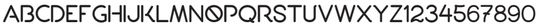

# CHAOSS Visual Identity

### What is CHAOSS Visual Identity?

It is the visible elements of a brand, such as color, design, logo, typography, and the symbol that identify and distinguish the brand in consumers' minds.

### Why it is needed?

It is important to portray the identity of CHAOSS across all platforms in a consistent manner. 

### Who can use it?

It can be used by developers, documentarians, marketers or anyone who want to showcase the identity of the CHAOSS community

## Visual Guidelines

* **CHAOSS logo in color**





* **CHAOSS logo in black**



* **CHAOSS logo in White**



### Color Palette

**Color Used:** 

* PANTONE RUBINE RED C  
* PANTONE 2925 C  
* PANTONE 570 C  
* PANTONE VIOLET 0631 C  

### Font

Font used in the CHAOSS logo is **PORT**

